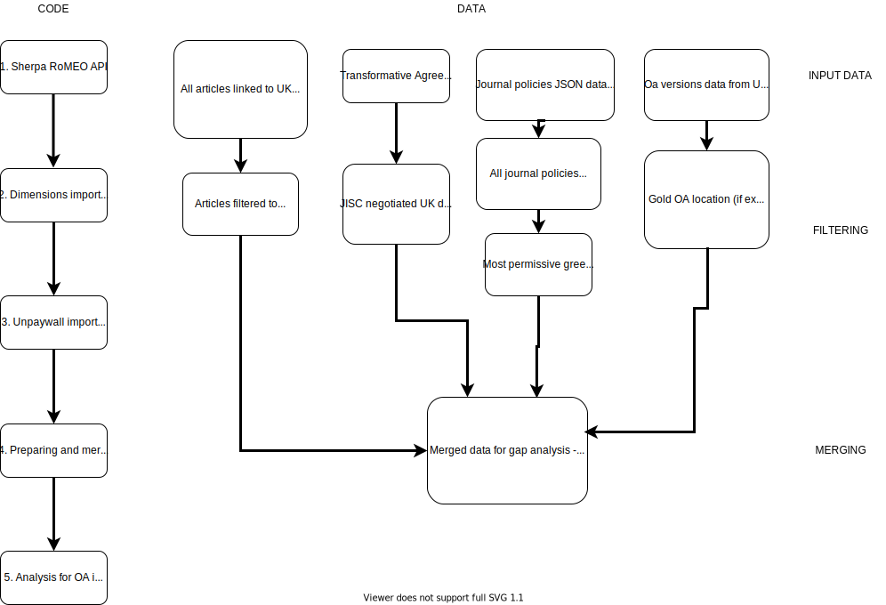

# Open Access Publication Venue Gap Analysis

This repository documents the process used to download, merge, clean and analyse data for the Open Access Publication Venue Gap Analysis. The data was generated using a set of R scripts, which are linked together as shown in the Workflow.

# Workflow
The workflow used to generate the merged publication venue gap analysis data.

# Setting up the project folder
The first step was/ is to create an RStudio project file (see blog on this here https://martinctc.github.io/blog/rstudio-projects-and-working-directories-a-beginner's-guide/), along with subfolders for 
- ‘Data’ = this is where all the data will be stored, it should also contain a subfolder called ‘Raw data’
- ‘Outputs’ = this is where all the tables and charts will go
- ‘Scripts’ = this is where all the code goes
  
# Data Scripts
The first three scripts download and clean the data ready for filtering, merging, and deriving new variables in the fourth script and analysis in the fifth script. These scripts were last run on the week commencing 5th July 2021, with the final merged dataset then uploaded to the DataHub

1 Sherpa RoMEO API: This code downloads data on journal OA policies from the SHERPA API in .json and then filters it to return only the variables we are interested in, and converts it into a data frame with one row for each journal policy (i.e. if a journal has four policies it will have four rows). It also does a bit of basic cleaning of the data. It then saves the file out as .Rda and .xlsx.

2 Dimensions import and cleaning: This code imports Dimensions data and cleans it. The data was downloaded for us by Katie Shamash at Dimensions as this is the easiest option, but it could also be downloaded using the Dimensions API (see code for doing this in superceded folder). Once the data is imported, the code gets rid of duplicates, cleans variables, derives new variables, then saves it out as .xlsx and .Rda.

3. Unpaywall API and cleaning: This code uses Unpaywall API to download unpaywall OA routes for the DOIs in the Dimensions sample. It then identifies the most permissive green and gold routes to OA for each where they exist. It prioritises according to the UKRI policy (rather than Dimensions own assessment of best_oa_location) and identifies a green and gold route where both exist

4. Preparing and merging PVGA data: This data imports previously produced data from Sherpa, Dimensions and Unpaywall, and imports new data from ESAC. It then merges them all together and creates new variables from the merged data, in particular focusing on compliance with various policy scenarios.

# Analysis Script

5. Analysis for OA impact assessment: This runs through all the analysis used in the OA Policy Impact Assessment, which is the document this analysis was published in.

NB. There is also a folder of Old or superceded code - this should not be needed but does contain some additional analysis not included in the main file. The other scripts cover the main analysis and various different smaller bits of analysis. This folder also contains the code used to upload the data to datahub

